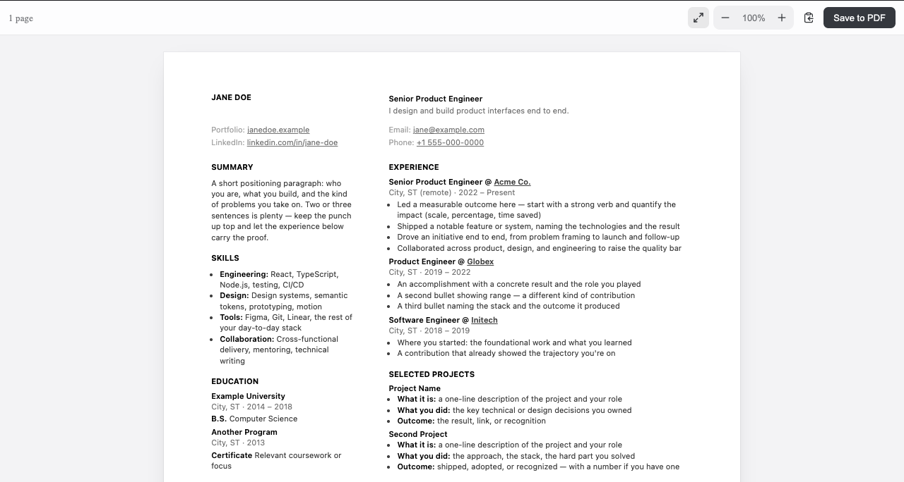

# @atom63/resume

**Write your resume and CV as MDX — paginated, print-ready, in React.**

**▸ Try it live — [resume.atom63.io](https://resume.atom63.io/)** — edit MDX in the browser (by hand or with any LLM) and export a print-ready PDF.

A resume is just an `.mdx` file built from a small grammar of composable
primitives. The engine paginates it into real 8.5×11″ (or A4) pages, renders a
zoom/pan viewer, and prints to a clean multi-page PDF. Because the document is
*code*, a coding agent (Claude Code, Cursor, …) can write it from your notes —
and you keep the MDX as the source of truth.

[](https://resume.atom63.io/)

> Status: `0.2.x`. The API may shift before `1.0`. See the [changelog](packages/resume/CHANGELOG.md).

## Two ways to use it

### 1. Scaffold a project

```bash
npm create @atom63/resume@latest my-resume
cd my-resume && npm install && npm run dev
```

You get a standalone Vite app with starter `src/resume.mdx` (two-column) and
`src/cv.mdx` (single-column). Point a coding agent at those files to write the
content; Save to PDF from the viewer toolbar.

### 2. Add the module to a React app

```bash
npm i @atom63/resume
```

```tsx
import { ResumeViewer } from '@atom63/resume'
import '@atom63/resume/styles' // import the styles ONCE in your app
import Resume from './resume.mdx'

export default () => <ResumeViewer Content={Resume} pdfFilename="Resume" pageSize="letter" />
```

Your app needs the MDX + raw-import Vite wiring shown in the scaffolded
`vite.config.ts` (`@mdx-js/rollup` + `mdxRawPlugin` from `@atom63/resume/vite`).

## Exports

| Export | What it is |
|---|---|
| `@atom63/resume` | `ResumeViewer`, the `PaginatedResume` engine + MDX primitives, `packIntoPages`, `useResumeViewport`, `getPageGeometry` |
| `@atom63/resume/editor` | `ResumeEditor` + `MdxLivePreview` — optional in-app live MDX editor |
| `@atom63/resume/vite` | `mdxRawPlugin` (so `import src from './resume.mdx?raw'` works) + `resumeWriteBackPlugin` |
| `@atom63/resume/styles` | import-and-done stylesheet (tokens + document + viewer chrome) |
| `@atom63/resume/tokens` | just the `--doc-*` design tokens |

## The MDX grammar

```mdx
<ResumeDocument>
  <Header>
    <HeaderLeft># Jane Doe</HeaderLeft>
    <HeaderRight>Senior Product Engineer</HeaderRight>
  </Header>
  <Columns>
    <Sidebar>
      ### Skills
      - TypeScript, React
    </Sidebar>
    <Main>
      ### Experience
      <Group>
        #### Engineer @ Acme
        _2022 – Present_
        - Built things.
      </Group>
    </Main>
  </Columns>
  <Footer>jane@example.com</Footer>
</ResumeDocument>
```

Single-column CVs put everything in `<Main>` and use `<Section label="…">` +
`<Entry year role>` record rows.

## Restyle (modify)

The look is a **Tailwind-free** token system. Override any token, scoped to
`[data-resume-document]` (in your app's CSS, loaded after `@atom63/resume/styles`):

```css
[data-resume-document] {
  --doc-text: 11px; /* body size */
  --doc-ink: #111; /* headings + bold */
  --doc-ink-body: #404040; /* body copy */
  --doc-resume-cols: 1fr 2fr; /* sidebar : main ratio */
  --doc-font: 'Charter', Georgia, serif; /* or `inherit` to follow the host font */
}
```

- **Paper size** is the `pageSize` prop (`'letter' | 'a4'`), not a token — it drives
  pagination, the on-screen page, and the PDF.

## Extend

Add your own section types by passing a custom MDX component map to
`ResumeViewer` (it merges over the defaults):

```tsx
import { ResumeViewer, resumeMdxComponents } from '@atom63/resume'

function SkillBar({ label, level }: { label: string; level: number }) {
  return (
    <div className="doc-meta-grid">
      <span className="doc-meta">{label}</span>
      <div style={{ background: '#eee', height: 4 }}>
        <div style={{ width: `${level}%`, height: 4, background: '#111' }} />
      </div>
    </div>
  )
}

<ResumeViewer Content={Resume} components={{ ...resumeMdxComponents, SkillBar }} />
```

Then use `<SkillBar label="React" level={90} />` in your MDX. The `.doc-*` classes
compose with the token system, so custom components stay on-brand. Each top-level
child of a `<Sidebar>` / `<Main>` is one pagination block, so pages break cleanly
between them.

## Limitations

- Markdown tables render unstyled (the engine ships no table styling).

## Development

This repo is a **generated mirror** of the toolchain, which is developed in the
[atom63 monorepo](https://github.com/atom63/atom63-vite) (the OS63 desktop
dogfoods the engine via a workspace link). Don't hand-edit the mirror — changes
are synced from upstream. Issues and PRs are welcome here; fixes land upstream.

```bash
pnpm install
pnpm -r build
pnpm -r test
```

## License

MIT
